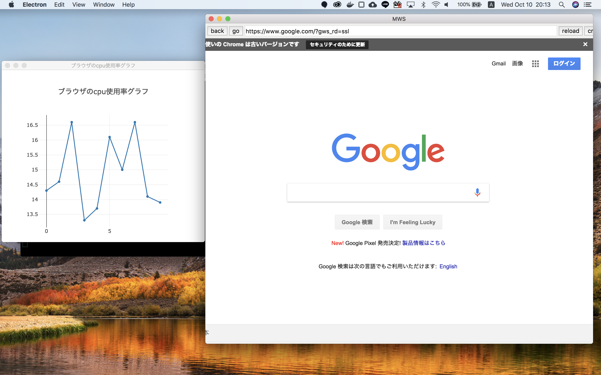
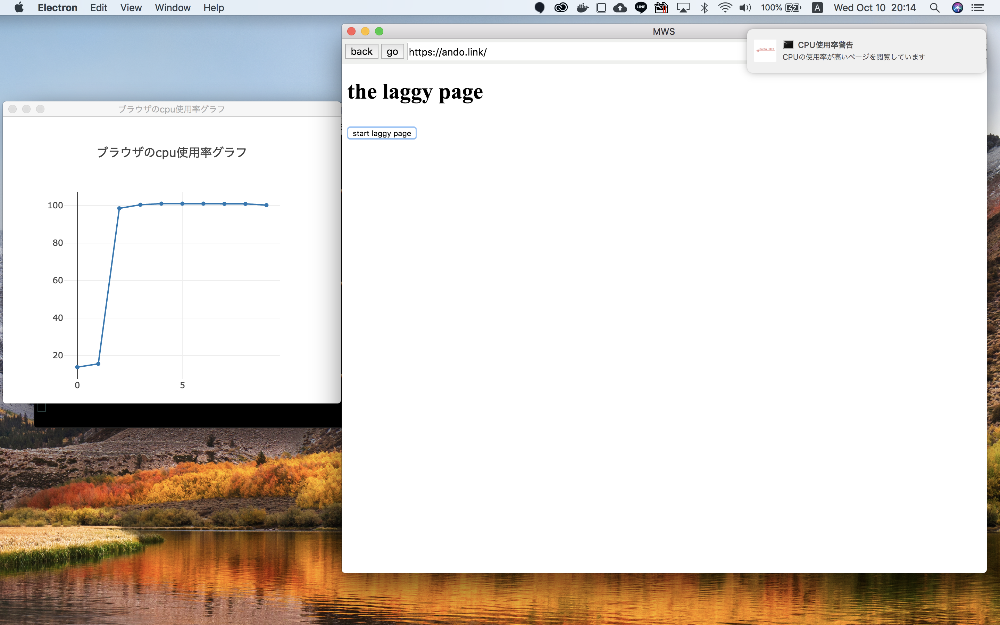

mwscup
====
　近年問題となっている、webブラウザ上で閲覧者に気が付かれず仮想通貨を採掘するツール（マイニングツール）を設置しているウェブサイトが確認されています。  
　このようなマルウェアの設置されているwebサイトにアクセスした場合、計算資源を奪われ、会社運営業務の妨げになるようなことが考えられます。  
　このような計算リソースを奪うwebサイトを検出して、利用者に通知することで、計算資源の盗難を防ぐことに繋がります。

## Description
　近年問題となっている、webブラウザ上で閲覧者に気が付かれず仮想通貨を採掘するツール（マイニングツール）を設置しているウェブサイトが確認されています。  
　このようなマルウェアの設置されているwebサイトにアクセスした場合、計算資源を奪われ、会社運営業務の妨げになるようなことが考えられます。  
　このような計算リソースを奪うwebサイトを検出して、利用者に通知することで、計算資源の盗難を防ぐことに繋がります。　　
　グラフによる可視化でどのwebサイトがどれだけのリソースを消費しているのかを簡単に確認できます

## Demo
- グーグルにアクセスした場合
　　
　　
  
- とても重いサイトにアクセスした時、CPUの使用率上昇の警告がでる。


## Requirement
``node.js``および管理パッケージ``npm``が必要です  
OSはUNIXシステムおよびMACOSにのみ対応しています。動作確認済みは下記のものになります。
- **Mac OS X 10.13.5**
- **Ubuntu 14.04**
- **Ubuntu 16.04**

※Ubuntuのaptでインストールするとコマンド名がnodejsなのでシンボリックなどを使用してnodeにしてください


## install & usage
```bash:bash
git clone https://github.com/takashiAg/mwscup
cd mwscup
npm install
npm start
```
```
#スタートのときは下記コマンドだけでも構いません
npm start
```

## 参照文献
- https://qiita.com/Quramy/items/a4be32769366cfe55778
- https://qiita.com/mamosan/items/084039c3e6d703b7b45f
- https://stackoverflow.com/questions/31759367/using-console-log-in-electron-app